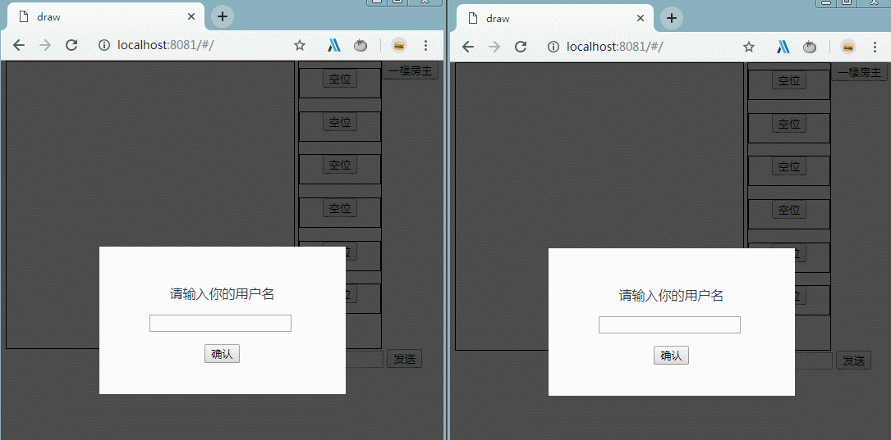
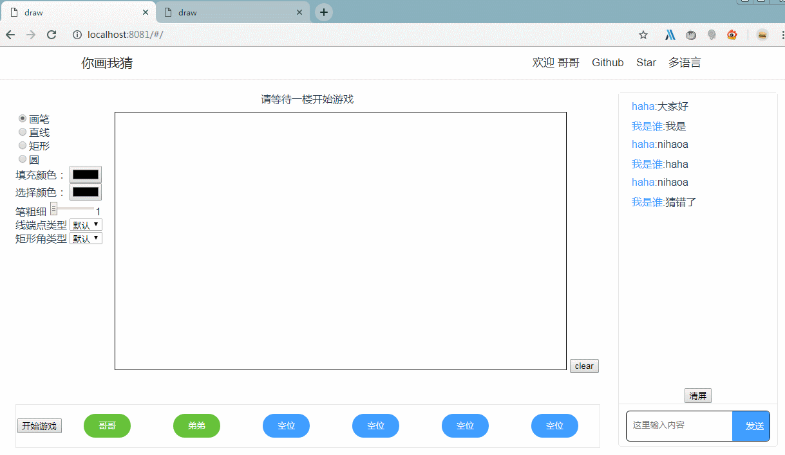

# vue+canvas+websocket+less

为了练习canvas、websocket、node做的一个小游戏，<a href="https://buppt.github.io/vue-canvas-websocket/dist/">可以点击这里在线查看</a>。

## 项目截图



## Build Setup
```bash
//clone
npm install
//start server
node app.js
//start vue in another terminal
npm run dev
```

## 完成进度

- [x] 登录，登录后username存储到了sessionStorage中。
- [x] 座位，登录后可以选择座位，并通过ws告诉所有人你的座位。
- [x] 发送内容，登录后可以通过ws将输入内容发布给所有人。
- [x] 聊天记录，可以接收所有人的聊天打字内容，可以清屏。
- [x] 开始游戏，一楼可以点击开始游戏按钮，开始游戏后不可再调整座位。
- [x] 按座位顺序轮流进行画图与看图猜词，画图玩家不可以输入内容与发送内容。
- [x] 随机在词表中选择词语。用于练习只写了12个词。
- [x] 发送内容为正确词时特殊显示（游戏开始后有效）。
- [ ] 记分
- [ ] 多房间游戏
- [ ] 移动端


