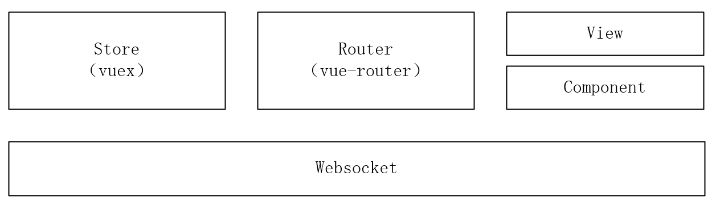

# vue+canvas+websocket+less

为了学习canvas和websocket做的一个小游戏，<a href="https://buppt.github.io/vue-canvas-websocket/dist/">可以点击这里在线查看</a>。求star～

## 项目截图


## 项目架构


## Build Setup
```bash
//clone
npm install
//start server
node app.js
//start vue in another terminal
npm run dev
```

## 完成进度

- [x] 登录，登录后username存储到了sessionStorage中。
- [x] 座位，登录后可以选择座位，并通过ws告诉所有人你的座位。
- [x] 发送内容，登录后可以通过ws将输入内容发布给所有人。
- [x] 聊天记录，可以接收所有人的聊天打字内容，可以清屏。
- [x] 开始游戏，一楼可以点击开始游戏按钮，开始游戏后不可再调整座位。
- [x] 按座位顺序轮流进行画图与看图猜词，画图玩家不可以输入内容与发送内容。
- [x] 随机在词表中选择词语。用于练习只写了12个词。
- [x] 发送内容为正确词时特殊显示（游戏开始后有效）。
- [ ] 记分
- [ ] 多房间游戏
- [ ] 移动端

## 客户端
前端从前面的截图可以看到，基本分为四部分，画图部分，选择座位部分，聊天显示部分，发送聊天部分。四部分当然要使用一个websocket连接，所以使用了vuex，同时在vuex中保存用户名等数据。

建立ws连接，存入vuex中。
```javascript
this.ws = new WebSocket('ws://localhost:3000/');
this.$store.commit('wsStore/connect',ws);
```
### 登录部分
这里登录不太重要，就直接把用户名放到sessionStorage里了，同时再存入vuex中供其他部分使用。
```javascript
saveName(){
    if(!window.sessionStorage){
        alert("浏览器不支持sessionStorage!");
    }else{
        let storage = window.sessionStorage;
        storage.setItem("username",this.inputName);
    }
    this.username=this.inputName;
    this.showLogin=0;
    this.$store.commit('username/setUsername',this.inputName)
}
```
完整代码可以查看<a href="https://github.com/buppt/canvas-websocket-learn/blob/master/src/components/HomeHeader.vue">src/components/HomeHeader.vue文件</a>。
### 画图部分
这部分是最主要的部分，先定义一个canvas
```html
<canvas id="drawBoard" width="700" height="400"></canvas>
```
然后是一个class draw，这里只是使用画笔的函数，从上面gif可以看出来还可以画直线，矩形，圆，调整颜色等，最后也都是写到这个类里面的。
```javascript
class canvasDraw{
	constructor(id,ws){
		this.ws= ws;
		this.canvas = document.getElementById(id);
		this.ctx = this.canvas.getContext('2d');
		this.stage_info = this.canvas.getBoundingClientRect()
		this.path = {
			beginX: 0,
			beginY: 0,
			endX: 0,
			endY: 0
		}
		this.isDraw=false
	}
	draw(){
		let that = this
		this.canvas.onmousedown = () => {
			that.ctx.beginPath()
			that.path.beginX = event.pageX - that.stage_info.left
			that.path.beginY = event.pageY - that.stage_info.top
			that.ctx.moveTo(
				that.path.beginX,
				that.path.beginY
			)
			that.isDraw=true
		}
		this.canvas.onmousemove = () => {
			if(that.isDraw){
				that.drawing(event)
			}
		}
		this.canvas.onmouseup = () => {
			that.isDraw=false
			that.ws.send('stop,')
		}
	}
	drawing(e) {
		this.path.endX = e.pageX - this.stage_info.left
		this.path.endY = e.pageY - this.stage_info.top
		this.ctx.lineTo(
			this.path.endX,
			this.path.endY
		)
		this.ctx.stroke()
		this.ws.send(`draw,${this.path.beginX},${this.path.beginY},${this.path.endX},${this.path.endY}`)

	}
	clearCanvas(){
		this.ctx.clearRect(0,0,this.canvas.width,this.canvas.height); 
		this.ws.send('clear,')
	}
}
```
可以看到，构造函数主要是保存起始和终点的坐标，虽然画笔可以随便画，但是也是由一小段一小段线段组成的。

然后draw函数，当监听到mousedown事件后，新建一条路径，将起始坐标保存下来，随着mousemove事件，鼠标每移动一点，就画一条线段，直到监听到mouseup事件，完成一次画线。

画直线、矩形、圆的原理差不多，都是保存鼠标的起始和终点坐标，然后算一下矩形的长和宽，圆的圆心和半径即可。以画圆的代码为例。
```javascript
drawRound(){
		this.canvas.onmousedown=()=>{
			this.ctx.beginPath()
			this.path.beginX = event.pageX - this.stage_info.left
			this.path.beginY = event.pageY - this.stage_info.top
		}
		this.canvas.onmouseup=()=>{
			this.path.endX = event.pageX - this.stage_info.left
			this.path.endY = event.pageY - this.stage_info.top
			let width = this.path.endX-this.path.beginX;
			let height = this.path.endY-this.path.beginY;
			this.ctx.arc(this.path.beginX+width/2, this.path.beginY+height/2,Math.sqrt(width*width+height*height)/2,0, Math.PI *2);
			this.ctx.fill();
			this.ctx.stroke();
		}
	}
```
改变线条宽度、颜色等就更简单了，只要将选择的数值传到类中的如下函数里即可。
```javascript
changeColor(color){
	this.ctx.strokeStyle = color;
}
```
完整代码可以查看<a href="https://github.com/buppt/canvas-websocket-learn/blob/master/src/components/DrawBoard.vue">src/components/DrawBoard.vue文件</a>。
### 座位部分
这一部分就没什么了，就点击button，做一下判断就好了。例如
```javascript
seatDown(index){
	if(this.$store.state.wsStore.ws.readyState==3){
		this.$message('服务器未连接');
		return ;
	}
	if(this.username==null||this.username==''){
		this.$message('请登陆');
	}else if(this.seats[index]=='空位'){
		this.$store.state.wsStore.ws.send(`seats,${index},${this.username}`);
	}else{
		this.$message('此位置有人');
	}
},
```
如果是一楼的话，可以开始游戏，开始游戏就给后端发一个信号，然后就是后端的一些逻辑了。
```javascript
begin(){
	this.$store.state.wsStore.ws.send(`begin,`);
},
```
还有，如果游戏开始之后，不可以再调整座位或者新用户坐下。
```javascript
watch:{
	beginGame(newval,oldval){
		let buttonEle = document.querySelectorAll('button[component="seat"]');
		if(this.beginGame){
			for(let bt of buttonEle){
				bt.setAttribute('disabled','disabled');
			}
		}else{
			for(let bt of buttonEle){
				bt.removeAttribute('disabled');
			}
		}
	}
},
```

完整代码可以查看<a href="https://github.com/buppt/canvas-websocket-learn/blob/master/src/components/TheSeats.vue">src/components/TheSeats.vue文件</a>。
### 聊天显示部分
聊天显示部分只负责将接受到的服务器的消息显示出来，可以清屏。
```javascript
<div v-for="(record,index) in chatRecords" :key="index" class="record">
    <span class="blue">{{record.username}}</span>:{{record.content}}
</div>
watch:{
      msg(newval,oldval){
        let record = {
            username: this.msg[1],
            content: this.msg[2]
        };
        this.chatRecords.push(record);
        let div = document.getElementById('totalBoard')
        div.scrollTop = div.scrollHeight;
        console.log(div.scrollTop,div.scrollHeight+100)
      }
  },
```
完整代码可以查看<a href="https://github.com/buppt/canvas-websocket-learn/blob/master/src/components/ChatBoard.vue">src/components/ChatBoard.vue文件</a>。
### 聊天输入部分
聊天输入部分只负责将数据发送给服务器，然后服务器再发送给所有用户，上面的聊天显示部分接受到之后显示出来。
```javascript
submitWord(){
    if(this.$store.state.wsStore.ws.readyState==3){
        this.$message('服务器未连接');
        return ;
    }
    if(this.username==null||this.username==''){
        this.$message('请登陆');
        return ;
    }
    if(this.guassWord!=''){
        this.$store.state.wsStore.ws.send(`chat,${this.username},${this.guassWord}`);
        this.guassWord='';
    }
}
```
还有如果轮到自己画的话，不可以发送信息。
```javascript
watch:{
   drawuser(newval,oldval){
       let inputEle = document.querySelector('input[component="inputBoard"]');
       let buttonEle = document.querySelector('button[component="inputBoard"]');
       if(this.drawuser==this.username){
           inputEle.setAttribute('disabled','disabled')
           buttonEle.setAttribute('disabled','disabled');
       }else{
           inputEle.removeAttribute('disabled');
           buttonEle.removeAttribute('disabled');
       }
   }
},
```
完整代码可以查看<a href="https://github.com/buppt/canvas-websocket-learn/blob/master/src/components/InputBoard.vue">src/components/InputBoard.vue文件</a>。

## 服务端
服务端使用了node的ws模块，写的比较简单，只是满足了游戏需要。

主要是将用户画图时的起始和终点坐标做一个转发。

有用户坐下或调整座位后发送一下最终的座位信息。

游戏开始后，按座位顺序，轮流给每个人发送画图人和要画的词。

用户输入后判断是否为正确词，如果不对，就发送原词，如果猜对了，就发送“猜对了”

```javascript
// 导入WebSocket模块:
const WebSocket = require('ws');

// 引用Server类:
const WebSocketServer = WebSocket.Server;

// 实例化:
const wss = new WebSocketServer({
    port: 3000
});

let seats=['空位','空位','空位','空位','空位','空位']
let dict=['老鼠','牛','老虎','兔子','龙','蛇','马','羊','猴子','鸡','狗','猪']

let gameBegin = false;
let guassWord = '';
wss.on('connection', function (ws) {
    console.log(`[SERVER] connection()`);
    ws.on('message', function (message) {
        console.log(`[SERVER] Received: ${message}`);
        let msg = message.split(',');
        if(msg[0]=="seats"&&msg.length==3){
            let i = seats.indexOf(msg[2])
            if(i>-1){
                seats[i]='空位';
            }
            seats[msg[1]]=msg[2];
            wss.clients.forEach((client) => {
                client.send(`seats,${seats}`)
            })
        }else if(msg[0]=='begin'){
            function settime(username,ms){
                let i = Math.floor(Math.random()*dict.length);
                setTimeout(()=>{
                    guassWord=dict[i];
                    wss.clients.forEach((client) => {
                        client.send(`begin,${username},${dict[i]}`)
                    })
                },ms)
            }
            gameBegin=true;
            let ms = 0;
            for(let username of seats){
                if(username!='空位'){
                    settime(username,ms)
                    ms+=10000;
                }
            }
            setTimeout(()=>{
                wss.clients.forEach((client) => {
                    client.send(`end,`)
                })
                gameBegin=false;
            },ms)
        }else if(gameBegin&&msg[0]=='chat'&&msg[2]==guassWord){
            wss.clients.forEach((client) => {
                client.send(`chat,${msg[1]},猜对啦！`)
            })
        }else{
            wss.clients.forEach((client) => {
                    client.send(message)
            })
        }
		 
    })
});
```
