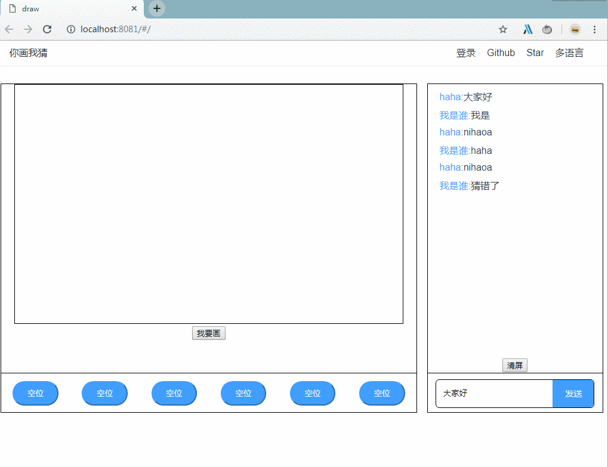
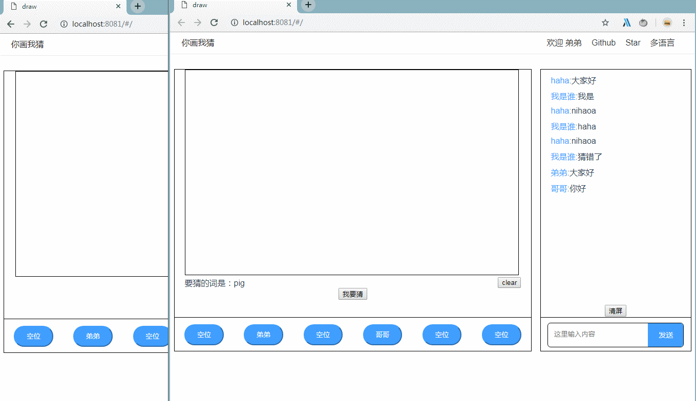

# vue+canvas+websocket+less

## Build Setup

```
npm install

node app.js

//another terminal
npm run dev
```


## 完成进度
- [x] 登录，登录后username存储到了sessionStorage中。
- [x] 座位，登录后可以选择座位，并通过ws告诉所有人你的座位。
- [x] 发送内容，登录后可以通过ws将输入内容发布给所有人。
- [x] 聊天记录，可以接收所有人的聊天打字内容。
- [x] 画图，目前只能通过点击“我要画”按钮进行画图。
- [x] 接收画图，默认情况或点击“我要猜”按钮可以查看他人画图。
- [ ] 开始游戏
- [ ] 轮流进行画图与看图猜词
- [ ] 猜词词表
- [ ] 发送内容为正确词时特殊显示
- [ ] 记分
- [ ] 多房间游戏
- [ ] 移动端

## 项目架构


## 项目截图

<br/>
